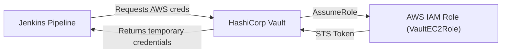

# 🔐 Secure AWS Infrastructure with Jenkins and Vault

This project demonstrates how to **securely manage AWS credentials using HashiCorp Vault** and dynamically inject them into **Jenkins CI/CD pipelines**, ensuring a **secretless Jenkins** environment.

## 🚀 Project Goals

- 🔒 Eliminate hardcoded AWS credentials from Jenkins.
- 🔁 Dynamically fetch short-lived AWS credentials from Vault.
- ✅ Enforce least-privilege access using IAM roles and Vault policies.
- 📦 Automate CI/CD securely using Jenkins + Vault + AWS.

---

## 🛠️ Tech Stack

- **HashiCorp Vault** (Secrets Management)
- **AWS IAM** (Credential & Role Management)
- **Jenkins** (CI/CD Automation)
- **Terraform** (Optional - for infra as code)
- **Ubuntu** (Vault + Jenkins host)

---

## 🧩 Project Architecture



## 🔧 Setup Instructions
1. Vault Installation & Initialization
```bash
vault server -config=vault-config.hcl
vault operator init
vault operator unseal
vault login <RootToken>
```

2. Enable & Configure AWS Secrets Engine in Vault
```bash
vault secrets enable -path=aws aws

vault write aws/config/root \
    access_key=<AWS_ACCESS_KEY> \
    secret_key=<AWS_SECRET_KEY> \
    region=us-east-1

vault write aws/roles/my-role \
    credential_type=assumed_role \
    role_arn=arn:aws:iam::<account_id>:role/VaultEC2Role
```

3. Vault Policy for Jenkins
Create jenkins-policy.hcl:
```bash
path "aws/creds/my-role" {
  capabilities = ["read"]
}
```


Apply the policy:
```
vault policy write jenkins-policy jenkins-policy.hcl
```
Create token for Jenkins:
```bash
vault token create -policy=jenkins-policy
```

4. Jenkins Configuration

Install Vault CLI in Jenkins server.

Add VAULT_ADDR and VAULT_TOKEN as Jenkins Credentials (or environment variables).

Jenkins Pipeline Step:
```
pipeline {
  agent any
  environment {
    VAULT_ADDR = 'http://<vault_ip>:8200'
    VAULT_TOKEN = credentials('vault-token-id')
  }
  stages {
    stage('Get AWS Credentials from Vault') {
      steps {
        sh '''
        echo "[*] Fetching temporary AWS credentials from Vault..."
        CREDS=$(vault read -format=json aws/creds/my-role)
        echo $CREDS
        '''
      }
    }
  }
}
```

✅ Success Verification

- Jenkins logs show temporary credentials fetched from Vault.

- AWS logs confirm VaultEC2Role is being assumed dynamically.

- No static credentials are stored in Jenkins.

## 🙌 Author

Marius Songwa
🚀 DevOps Engineer | Cloud Engineer | DevSecOps Engineer | AWS | Azure | GCP | Kubernetes | Jenkins | Vault
📧 mariussongwa@outlook.com


